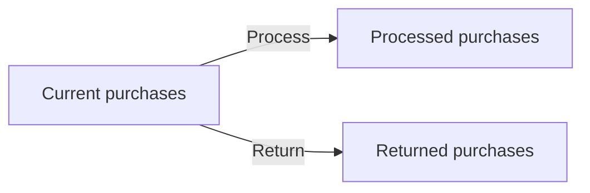
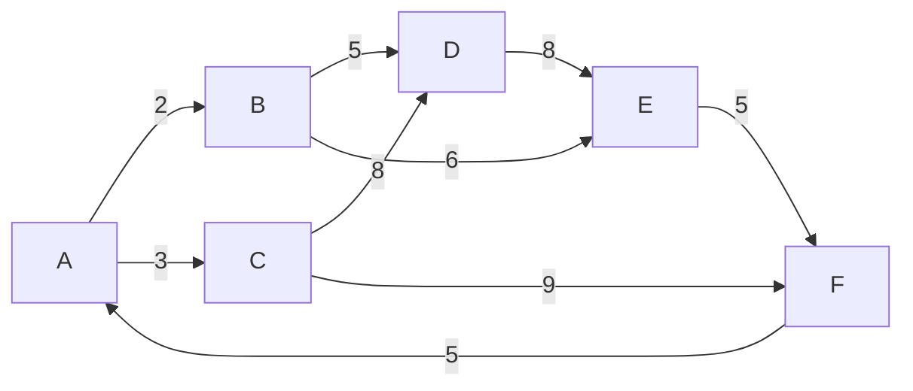

# Algorithms & Data Structures Portfolio

[](python/)
[](cpp/)
[](cpp/CMakeLists.txt)
[](https://github.com/ibrahimm2106/Algorithms-Data-Structures-Portfolio/actions/workflows/ci.yml)

A practical portfolio of **algorithms and data structures** built from university Algorithms coursework and refined into a clean, executable, testable repository.

The project demonstrates Python and C++ through string processing, queues, linked lists, sorting, graph search, priority queues, hash tables and binary search trees.

> **Portfolio note:** the coursework concepts and original student code form the basis of this project. The repository has been reorganised and enhanced after the module with modular implementations, automated tests, CMake and CI. Coursework 2's executable Python examples are portfolio companion implementations to the original report/diagram work.

## Highlights

- **Queue-based String Processor** implementing the four Coursework 1 examples.
- **C++ Online Store** using three singly linked lists and explicit pointer management.
- **Merge Sort, Quick Sort and Insertion Sort** implementations.
- **Dijkstra's shortest-path algorithm** using a heap-based priority queue.
- **26-bucket hash table** demonstrating collision handling through chaining.
- **Binary Search Tree** with search and in-order traversal.
- **Automated Python and C++ tests** through GitHub Actions.
- Clear architecture, algorithm and testing documentation for reviewers.

## Skills demonstrated

| Area | Evidence in this repository |
|---|---|
| Python | OOP, `deque`, `heapq`, type hints, modules, unit tests |
| C++ | C++17, classes, structs, raw pointers, linked lists, RAII cleanup |
| Algorithms | Merge Sort, Quick Sort, Insertion Sort, Dijkstra |
| Data structures | Queue, linked list, priority queue, hash table, BST |
| Software quality | Input validation, deterministic APIs, tests, CMake, CI |
| Problem solving | Translating coursework specifications into executable solutions |

## Repository structure

```text
.
├── .github/workflows/ci.yml
├── cpp/
│   ├── CMakeLists.txt
│   ├── include/OnlineStore.hpp
│   ├── src/
│   │   ├── OnlineStore.cpp
│   │   └── main.cpp
│   └── tests/test_online_store.cpp
├── docs/
│   ├── ALGORITHMS.md
│   ├── ARCHITECTURE.md
│   ├── COURSEWORK_CONTEXT.md
│   ├── DATA_STRUCTURES.md
│   └── TESTING.md
├── python/
│   ├── binary_search_tree.py
│   ├── dijkstra.py
│   ├── hash_table.py
│   ├── sorting_algorithms.py
│   └── string_processor.py
└── tests/test_algorithms.py
```

## Quick start

### Python examples

No third-party packages are required.

```bash
python python/string_processor.py
python python/sorting_algorithms.py
python python/dijkstra.py
python python/hash_table.py
python python/binary_search_tree.py
```

Run the complete Python test suite:

```bash
python -m unittest discover -s tests -v
```

### C++ Online Store

Requirements: a C++17 compiler and CMake 3.16+.

```bash
cmake -S cpp -B build
cmake --build build
ctest --test-dir build --output-on-failure
```

Run the demonstration program:

```bash
./build/online_store_demo
```

On multi-config Windows generators, the executable may be under `build/Debug` or `build/Release`.

## Coursework 1 — linear data structures

### String Processor

The task processes arrays such as:

```python
["Look, Example:", "+", " Here", "-", ": ,"]
```

The queue-based processor handles operations left-to-right and produces:

```text
LookExampleHere
```

### Online Store

The C++ class maintains:



It supports adding purchases, moving nodes between lists, sorting current purchases by customer ID, searching by customer ID and printing each state.

## Coursework 2 — algorithms and search structures

The coursework report demonstrated sorting algorithms, Dijkstra's algorithm, a chained hash table and a binary search tree. This portfolio adds runnable modules for each concept.

### Sorting example

Input:

```text
[2, 3, 5, 8, 6, 8, 9, 5]
```

Output from all three sorting implementations:

```text
[2, 3, 5, 5, 6, 8, 8, 9]
```

### Dijkstra example



From `A`, the implementation calculates the shortest distance to `F` as **12** via `A → C → F`.

## Documentation

- [Coursework context](docs/COURSEWORK_CONTEXT.md)
- [Algorithms guide](docs/ALGORITHMS.md)
- [Data structures guide](docs/DATA_STRUCTURES.md)
- [Architecture](docs/ARCHITECTURE.md)
- [Testing](docs/TESTING.md)

## Academic integrity

This repository is published as a **personal portfolio and educational record**. It should not be copied or submitted as coursework by other students.

## Author

**Mohamed Ibrahim**  
Software Engineering graduate  
GitHub: [@ibrahimm2106](https://github.com/ibrahimm2106)
