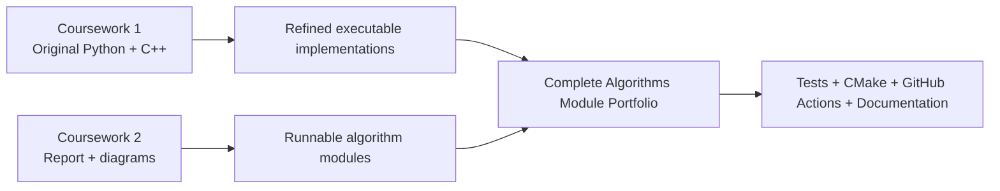

# Algorithms Module Portfolio — Coursework 1 & Coursework 2

[](python/)
[](cpp/)
[](cpp/CMakeLists.txt)
[](https://github.com/ibrahimm2106/Algorithms-Data-Structures-Portfolio/actions/workflows/ci.yml)

A finished portfolio presentation of my university **Algorithms (CMP020N203A)** module, bringing together both individual coursework components into one clean, executable and testable repository.

The module progressed from **linear data structures and pointer-based programming** in Coursework 1 to **sorting, shortest-path algorithms, hashing and tree structures** in Coursework 2. This repository keeps that progression visible while also showing how the original work was refined into a stronger software portfolio after submission.

> **Academic transparency:** original coursework snapshots are preserved separately from the polished portfolio implementations. Automated tests, modularisation, CMake, CI and some executable Coursework 2 companion implementations were added later for portfolio quality.

## Module at a glance

| Coursework | Focus | Main work |
|---|---|---|
| **Coursework 1** | Programming with linear data structures | Python String Processor, C++ Online Store, queues, linked lists, pointers, searching and sorting |
| **Coursework 2** | Algorithms & data structures report | Merge Sort, Quick Sort, Insertion Sort, Dijkstra, hash table with chaining, binary search tree |

### From coursework to finished product



## Explore both courseworks

- **[Coursework 1 — Linear Data Structures](coursework/coursework-1/README.md)**  
  Original student-code snapshots plus the finished String Processor and Online Store implementations.

- **[Coursework 2 — Algorithms & Search Structures](coursework/coursework-2/README.md)**  
  Sorting, Dijkstra, hash-table and BST work from the report, together with executable portfolio companion modules.

- **[Coursework evolution](docs/COURSEWORK_CONTEXT.md)**  
  Explains what came from the original submissions and what was later improved for GitHub.

## Finished portfolio features

- **Queue-based String Processor** covering all four Coursework 1 test cases.
- **C++17 Online Store** using three singly linked lists and explicit pointer management.
- **Merge Sort, Quick Sort and Insertion Sort** implementations.
- **Dijkstra's shortest-path algorithm** using a heap-based priority queue.
- **26-bucket hash table** with collision handling through chaining.
- **Binary Search Tree** with insertion, search and in-order traversal.
- **Automated Python tests** for the algorithm implementations.
- **CMake + CTest** for the C++ project.
- **GitHub Actions CI** for both languages.
- Dedicated coursework folders that preserve the module story rather than presenting disconnected code samples.

## Skills demonstrated

| Area | Evidence |
|---|---|
| Python | OOP, queues with `deque`, `heapq`, modules, type hints, unit tests |
| C++ | C++17, classes, structs, pointers, linked lists, memory cleanup, CMake |
| Sorting | Merge Sort, Quick Sort, Insertion Sort, Bubble Sort |
| Graph algorithms | Dijkstra's shortest-path algorithm and priority queues |
| Data structures | Queue, singly linked list, hash table with chaining, BST |
| Problem solving | Translating written algorithm specifications into working implementations |
| Software quality | Automated tests, CI, modular structure, documentation and reproducible builds |

## Repository structure

```text
.
├── coursework/
│   ├── coursework-1/
│   │   ├── README.md
│   │   └── original/
│   │       ├── Task1.py
│   │       ├── OnlineStore.cpp
│   │       └── Task1-Documentation.md
│   └── coursework-2/
│       └── README.md
├── python/
│   ├── string_processor.py
│   ├── sorting_algorithms.py
│   ├── dijkstra.py
│   ├── hash_table.py
│   └── binary_search_tree.py
├── cpp/
│   ├── CMakeLists.txt
│   ├── include/OnlineStore.hpp
│   ├── src/
│   │   ├── OnlineStore.cpp
│   │   └── main.cpp
│   └── tests/test_online_store.cpp
├── tests/
│   └── test_algorithms.py
├── docs/
│   ├── ALGORITHMS.md
│   ├── ARCHITECTURE.md
│   ├── COURSEWORK_CONTEXT.md
│   ├── DATA_STRUCTURES.md
│   └── TESTING.md
└── .github/workflows/ci.yml
```

## Coursework 1 — finished implementation

### String Processor

The original Python prototype is preserved in [`coursework/coursework-1/original/Task1.py`](coursework/coursework-1/original/Task1.py). The finished portfolio version is [`python/string_processor.py`](python/string_processor.py), which uses a queue because the specification processes operands from left to right and covers all four coursework examples.

Example:

```python
["Look, Example:", "+", " Here", "-", ": ,"]
```

Result:

```text
LookExampleHere
```

### C++ Online Store

The original single-file C++ implementation is preserved in [`coursework/coursework-1/original/OnlineStore.cpp`](coursework/coursework-1/original/OnlineStore.cpp).

The finished version under [`cpp/`](cpp/) separates interface, implementation, demo and tests. It manages three linked lists:


Supported operations include adding purchases, processing/returning nodes by position, sorting current purchases by customer ID, searching by customer ID and printing list state.

## Coursework 2 — finished implementation

The second coursework was report and diagram based. It covered:

- Merge Sort
- Quick Sort using the final element as pivot
- Insertion Sort
- Dijkstra's shortest-path algorithm
- Hash table with chaining
- Binary Search Tree

The portfolio turns each of those topics into a runnable Python module so the work can be explored beyond static diagrams.

The coursework sorting array is:

```text
[2, 3, 5, 8, 6, 8, 9, 5]
```

All three implementations produce:

```text
[2, 3, 5, 5, 6, 8, 8, 9]
```

For Dijkstra, the documented graph gives the shortest route from `A` to `F` as `A → C → F` with cost **12**. The repository also documents the original report's internal `12`/`13` inconsistency instead of silently hiding it.

## Run the project

### Python

```bash
python python/string_processor.py
python python/sorting_algorithms.py
python python/dijkstra.py
python python/hash_table.py
python python/binary_search_tree.py
python -m unittest discover -s tests -v
```

### C++

```bash
cmake -S cpp -B build
cmake --build build
ctest --test-dir build --output-on-failure
```

## Documentation

- [Coursework 1](coursework/coursework-1/README.md)
- [Coursework 2](coursework/coursework-2/README.md)
- [Coursework context & portfolio evolution](docs/COURSEWORK_CONTEXT.md)
- [Algorithms guide](docs/ALGORITHMS.md)
- [Data structures guide](docs/DATA_STRUCTURES.md)
- [Architecture](docs/ARCHITECTURE.md)
- [Testing](docs/TESTING.md)

## Academic integrity

This repository is published as a **personal portfolio and educational record**. Original coursework material is clearly labelled, and later portfolio improvements are separated from the submitted work. It should not be copied or submitted as coursework by other students.

## Author

**Mohamed Ibrahim**  
Software Engineering graduate  
GitHub: [@ibrahimm2106](https://github.com/ibrahimm2106)
