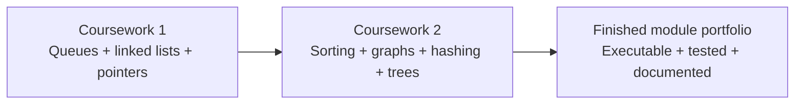

# Algorithms Module Coursework

This directory organises the two assessed coursework components from **Algorithms (CMP020N203A)** into a single module record.

| Coursework | Main focus | Portfolio section |
|---|---|---|
| Coursework 1 | Programming with linear data structures | [Open Coursework 1](coursework-1/README.md) |
| Coursework 2 | Sorting, graph algorithms and search structures | [Open Coursework 2](coursework-2/README.md) |

The purpose of this structure is to show the module as a progression rather than a collection of unrelated files:

Original coursework snapshots are clearly separated from later portfolio improvements so the repository remains academically transparent.
