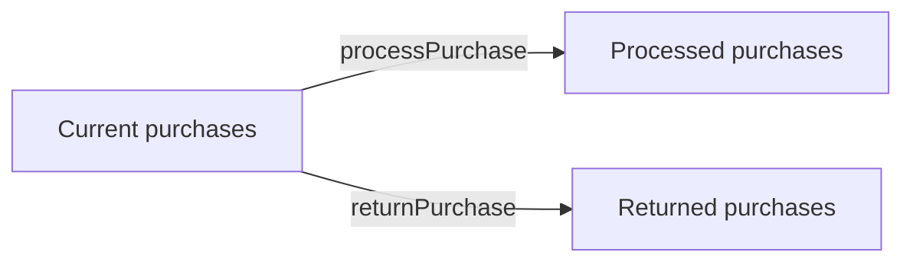

# Coursework 1 — Programming with Linear Data Structures

Coursework 1 focused on applying linear data structures in working programs. It consisted of two implementation tasks: a Python **String Processor** and a C++ **Online Store** based on linked lists and pointers.

This folder preserves the original student-code snapshots while linking to the refined portfolio versions used by the main repository.

## Task 1 — String Processor

The task processes alternating strings and `+` / `-` operators from left to right.

- `+` concatenates strings.
- `-` removes from the current result every character contained in the right-hand string.
- The coursework asked for a choice between a **queue** and a **stack**.
- Four test cases were specified.

### Original snapshot

[`original/Task1.py`](original/Task1.py) is the original simplified Python implementation supplied for the coursework record. It demonstrates the left-to-right processing idea and includes two simplified test cases.

The accompanying documentation described the processing sequence and how addition and subtraction change the resulting string; a portfolio-friendly text version is preserved in [`original/Task1-Documentation.md`](original/Task1-Documentation.md).

### Finished portfolio version

[`../../python/string_processor.py`](../../python/string_processor.py) completes the task as a queue-based implementation using `collections.deque`, handles all four coursework examples and validates token structure.

| Test | Expected result |
|---|---|
| `['x', '+', 'yz']` | `xyz` |
| `['32', '+', '+5', '+', '-8', '+', ' = 29.']` | `32+5-8 = 29.` |
| `['Look, Example:', '+', ' Here', '-', ': ,']` | `LookExampleHere` |
| `['any', '+', 'tnx', '-', 'nx', '-', 'y']` | `at` |

## Task 2 — C++ Online Store

The second task required an `OnlineStore` class using three linked lists:



Each purchase node stores:

- customer ID
- customer name
- purchased item
- purchase date
- pointer to the next node

Required behaviours included:

- adding purchases to the current list;
- processing a purchase by position;
- returning a purchase by position;
- sorting current purchases by customer ID;
- searching current purchases by customer ID;
- printing current, processed and returned purchases.

### Original snapshot

[`original/OnlineStore.cpp`](original/OnlineStore.cpp) preserves the original single-file implementation. It contains the `Node` structure, `OnlineStore` class, linked-list movement logic, bubble sorting, searching, printing and the coursework demonstration sequence.

### Finished portfolio version

The polished C++17 version is under [`../../cpp/`](../../cpp/):

```text
cpp/
├── CMakeLists.txt
├── include/OnlineStore.hpp
├── src/OnlineStore.cpp
├── src/main.cpp
└── tests/test_online_store.cpp
```

The finished version separates interface from implementation, keeps the linked-list concepts visible, adds a reproducible CMake build and includes automated CTest coverage.

## What Coursework 1 demonstrates

`Python` · `C++` · `Queues` · `Singly Linked Lists` · `Pointers` · `OOP` · `Searching` · `Bubble Sort` · `Memory Management` · `Testing`

## Portfolio note

The files under `original/` are preserved as coursework snapshots. The code under `python/` and `cpp/` represents the later cleaned and tested portfolio presentation, so the repository does not imply that post-submission improvements were part of the original hand-in.
