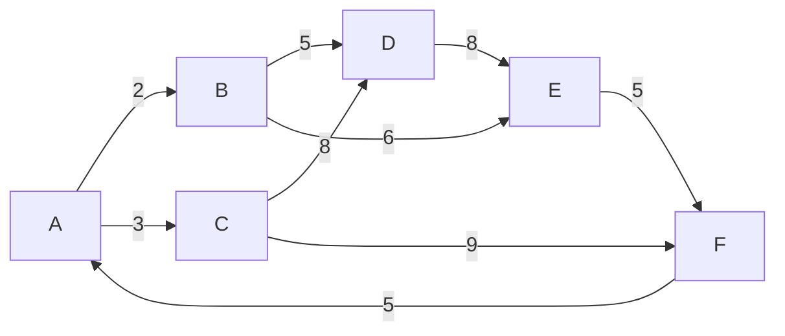

# Coursework 2 — Algorithms & Search Structures

Coursework 2 was a report-based assessment covering sorting algorithms, weighted shortest-path search and core search data structures. The original submission used diagrams, tables and written explanation; the finished portfolio adds runnable Python companion implementations for each topic.

## Task 1 — Sorting algorithms

The coursework used the array:

```text
[2, 3, 5, 8, 6, 8, 9, 5]
```

and demonstrated three sorting methods step by step:

### Merge Sort

The report showed the array being recursively divided into smaller sub-arrays and then merged back into sorted order.

**Portfolio implementation:** [`../../python/sorting_algorithms.py`](../../python/sorting_algorithms.py)

### Quick Sort

The coursework required the **last element as the pivot** and showed how the array was partitioned around that pivot before recursively sorting the sub-arrays.

**Portfolio implementation:** [`../../python/sorting_algorithms.py`](../../python/sorting_algorithms.py)

### Insertion Sort

The report illustrated the incremental process of placing each element into the correct position in the already-sorted prefix of the array.

**Portfolio implementation:** [`../../python/sorting_algorithms.py`](../../python/sorting_algorithms.py)

All three finished implementations produce:

```text
[2, 3, 5, 5, 6, 8, 8, 9]
```

## Task 2 — Dijkstra's shortest-path algorithm

The report applied Dijkstra's algorithm from start node `A`, showing the graph state and priority queue as nodes were processed.

The adjacency-list representation documented in the coursework is:



The executable portfolio version is [`../../python/dijkstra.py`](../../python/dijkstra.py) and uses Python's `heapq` as a priority queue.

| Destination | Distance | Shortest path |
|---|---:|---|
| A | 0 | A |
| B | 2 | A → B |
| C | 3 | A → C |
| D | 7 | A → B → D |
| E | 8 | A → B → E |
| F | 12 | A → C → F |

> **Source note:** the original report contains an internal inconsistency for node `F`: one written result states `13`, while the step diagram/priority queue and the documented edge weights support `12`. The portfolio implementation follows the documented graph and tests `12`.

## Task 3A — Hash table with chaining

The coursework created a 26-position alphabet hash table from letters in a full name. Repeated letters were handled with **chaining**, demonstrating collision handling and linked structures.

**Portfolio implementation:** [`../../python/hash_table.py`](../../python/hash_table.py)

The finished module exposes insertion, lookup and bucket inspection so the concept can be run rather than viewed only as a diagram.

## Task 3B — Binary Search Tree

The coursework built a BST from name characters, placing smaller values in the left subtree and larger values in the right subtree.

**Portfolio implementation:** [`../../python/binary_search_tree.py`](../../python/binary_search_tree.py)

The finished module demonstrates insertion, search and in-order traversal.

## What Coursework 2 demonstrates

`Merge Sort` · `Quick Sort` · `Insertion Sort` · `Dijkstra` · `Priority Queues` · `Graphs` · `Hash Tables` · `Chaining` · `Binary Search Trees` · `Algorithm Analysis`

## Finished-product view

Coursework 2 began as a visual and written algorithms report. In this repository it now forms the second half of a complete module portfolio: each concept has a runnable implementation, the results are testable, and the documentation links the executable code back to the original assessment topics.

See also:

- [`../../docs/ALGORITHMS.md`](../../docs/ALGORITHMS.md)
- [`../../docs/DATA_STRUCTURES.md`](../../docs/DATA_STRUCTURES.md)
- [`../../tests/test_algorithms.py`](../../tests/test_algorithms.py)
