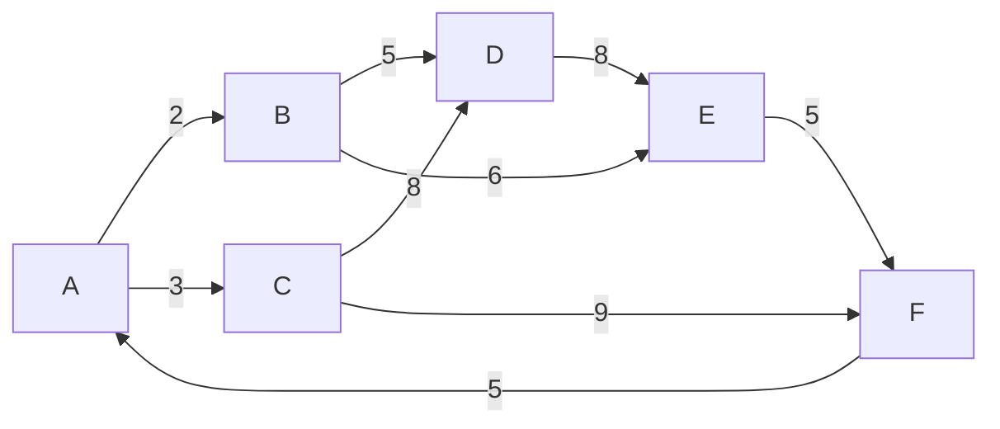

# Algorithms guide

## Sorting

| Algorithm | Main idea | Typical time | Worst case | Extra space |
|---|---|---:|---:|---:|
| Merge Sort | Recursively split, then merge ordered halves | O(n log n) | O(n log n) | O(n) |
| Quick Sort | Partition around a pivot; this project uses the last item as pivot | O(n log n) | O(n²) | O(log n) recursion average |
| Insertion Sort | Insert each item into the already-sorted prefix | O(n²) | O(n²) | O(1) |

The coursework array used in the report is:

```text
[2, 3, 5, 8, 6, 8, 9, 5]
```

All three implementations produce:

```text
[2, 3, 5, 5, 6, 8, 8, 9]
```

## Dijkstra's algorithm

The graph represented by the Coursework 2 report's adjacency list is:



Starting at `A`, the executable portfolio implementation computes:

| Destination | Distance | Shortest path |
|---|---:|---|
| A | 0 | A |
| B | 2 | A → B |
| C | 3 | A → C |
| D | 7 | A → B → D |
| E | 8 | A → B → E |
| F | 12 | A → C → F |

> **Source transparency:** the original Coursework 2 report contains an internal inconsistency around node `F`: its step diagram/priority queue shows `12`, while one written results section states `13`. Using the adjacency list documented in the report, `A → C → F` has cost `3 + 9 = 12`, so the executable portfolio version uses `12` and tests that result.

The implementation uses Python's `heapq`, giving efficient priority-queue operations.
