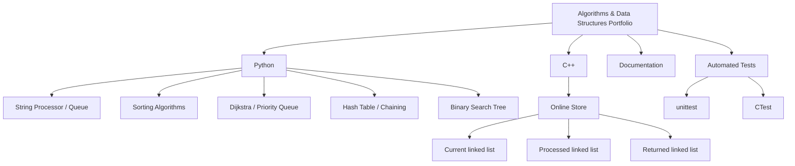

# Repository architecture

```mermaid
flowchart TD
    R[Algorithms & Data Structures Portfolio]
    R --> P[Python]
    R --> C[C++]
    R --> D[Documentation]
    R --> T[Automated Tests]

    P --> SP[String Processor / Queue]
    P --> S[Sorting Algorithms]
    P --> DJ[Dijkstra / Priority Queue]
    P --> HT[Hash Table / Chaining]
    P --> BST[Binary Search Tree]

    C --> OS[Online Store]
    OS --> L1[Current linked list]
    OS --> L2[Processed linked list]
    OS --> L3[Returned linked list]

    T --> PYT[unittest]
    T --> CT[CTest]
```
