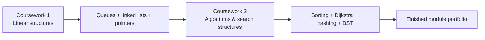

# Coursework context & portfolio evolution

This repository presents the complete body of work from **Algorithms (CMP020N203A)** as one finished technical portfolio. The module contained two individual coursework components with different formats, so the repository deliberately preserves both the original assessment context and the later software-engineering improvements.

## Coursework 1 — programming with linear data structures

Coursework 1 required two programs:

1. **String Processor** — process alternating strings and `+` / `-` operators from left to right while selecting an appropriate queue or stack data structure.
2. **Online Store** — use C++ linked lists and pointers to manage current, processed and returned purchases, including add, process, return, sort, search and print operations.

### What is preserved

The repository now keeps the supplied original source snapshots under:

```text
coursework/coursework-1/original/
├── Task1.py
├── OnlineStore.cpp
└── Task1-Documentation.md
```

This makes it possible to see the coursework starting point directly.

### What was improved later

The finished portfolio versions are separate:

- `python/string_processor.py` implements the full queue-based String Processor and all four coursework examples.
- `cpp/` refactors the Online Store into header/source/test files with CMake and CTest.

These changes are portfolio improvements rather than claims about the exact original submission.

## Coursework 2 — algorithms and data structures report

Coursework 2 was report and diagram focused. It covered:

- Merge Sort
- Quick Sort using the final element as pivot
- Insertion Sort
- Dijkstra's shortest-path algorithm
- a 26-bucket alphabet hash table using chaining
- a binary search tree built from name characters

The original work demonstrated these topics through written explanation, diagrams, queue states and tables. The executable modules in `python/` are **portfolio companion implementations added after the coursework** so each concept can be run and tested directly.

## Why both courseworks are combined

Together the two assessments show a clear progression:



Coursework 1 demonstrates implementation fundamentals and pointer-based data structures. Coursework 2 expands into algorithmic reasoning, graph search and non-linear data structures. The final repository therefore represents the module more accurately when the two pieces are viewed together.

## Source transparency

One Coursework 2 Dijkstra result is internally inconsistent in the report: a written table gives node `F` as `13`, while the documented graph and priority-queue state support `12`. The executable portfolio implementation follows the documented adjacency list (`A → C → F = 3 + 9 = 12`) and the discrepancy is explicitly documented rather than hidden.

## Finished-product additions

The following repository features were added to turn the module work into a professional GitHub portfolio:

- modular Python implementations;
- refactored C++17 project structure;
- automated unit tests;
- CMake and CTest;
- GitHub Actions CI;
- recruiter-friendly README/navigation;
- dedicated Coursework 1 and Coursework 2 pages;
- original-code snapshots for comparison;
- architecture, algorithm and testing documentation.

## Academic transparency

This repository is a **post-coursework portfolio presentation and educational record**. Original coursework material and later portfolio enhancements are clearly separated so that the repository demonstrates development and learning without implying that post-submission improvements were part of the original hand-in.
