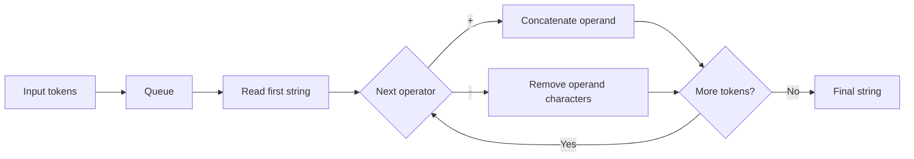
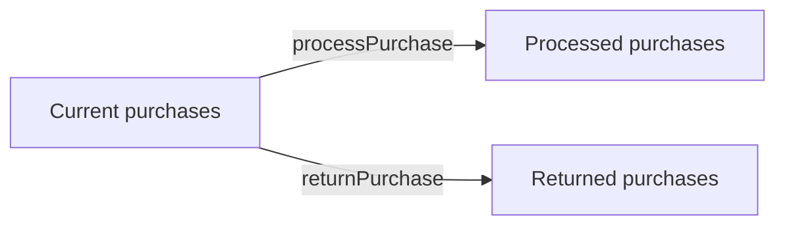

# Data structures

## Queue — String Processor

Coursework 1 processes tokens strictly from left to right, so a FIFO queue is a natural fit.



## Linked lists — Online Store

Three singly linked lists model the state of purchases:



Each purchase node stores customer ID, customer name, purchased item, purchase date and a pointer to the next node.

## Hash table

The alphabet hash table has 26 buckets. The hash function is:

```text
index = ord(lowercase_letter) - ord('a')
```

Repeated letters are retained in the bucket, demonstrating **chaining**.

## Binary search tree

Unique letters are inserted according to lexical order:

- smaller → left subtree
- greater → right subtree
- duplicate → ignored

An in-order traversal therefore returns the stored letters in sorted order.
